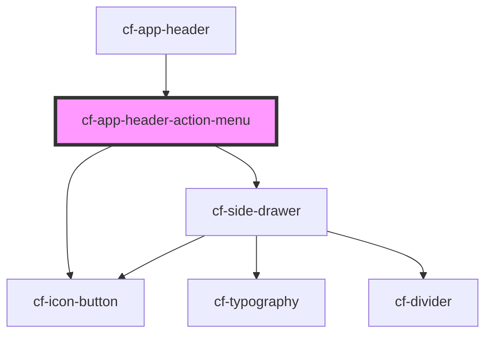

# cf-app-header-action-menu

<!-- Auto Generated Below -->

## Properties

| Property     | Attribute | Description | Type          | Default     |
| ------------ | --------- | ----------- | ------------- | ----------- |
| `actionMenu` | --        |             | `IActionMenu` | `undefined` |

## Dependencies

### Used by

 - [cf-app-header](..)

### Depends on

- [cf-icon-button](../../cf-icon-button)
- [cf-side-drawer](../../cf-side-drawer)

### Graph

----------------------------------------------

*Built with [StencilJS](https://stenciljs.com/)*
