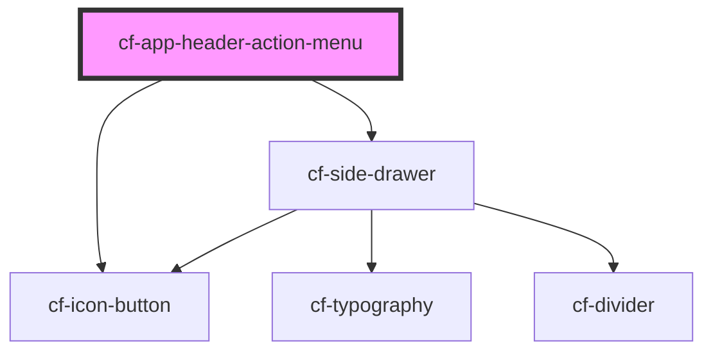

# cf-app-header-action-menu

<!-- Auto Generated Below -->

## Properties

| Property    | Attribute    | Description | Type     | Default     |
| ----------- | ------------ | ----------- | -------- | ----------- |
| `icon`      | `icon`       |             | `string` | `undefined` |
| `menuTitle` | `menu-title` |             | `string` | `undefined` |

## Dependencies

### Depends on

- [cf-icon-button](../../cf-icon-button)
- [cf-side-drawer](../../cf-side-drawer)

### Graph

----------------------------------------------

*Built with [StencilJS](https://stenciljs.com/)*
