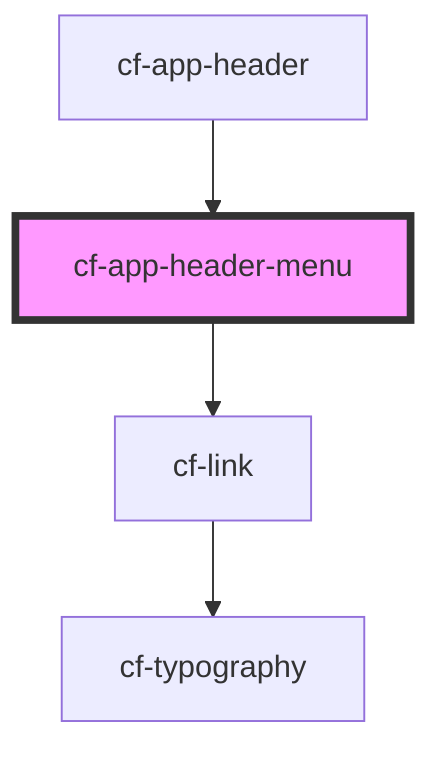

# cf-app-header-menu

<!-- Auto Generated Below -->

## Properties

| Property | Attribute | Description | Type         | Default |
| -------- | --------- | ----------- | ------------ | ------- |
| `menus`  | --        |             | `INavMenu[]` | `[]`    |

## Dependencies

### Used by

 - [cf-app-header](..)

### Depends on

- [cf-link](../../cf-link)

### Graph

----------------------------------------------

*Built with [StencilJS](https://stenciljs.com/)*
