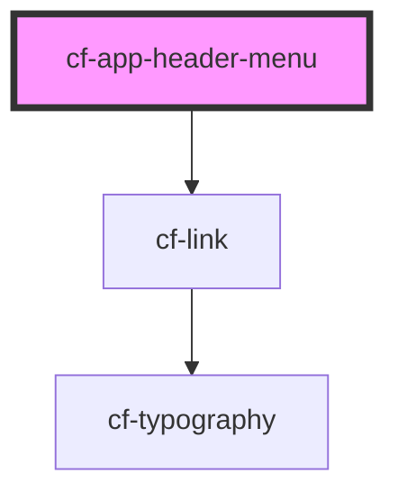

# cf-app-header-menu

<!-- Auto Generated Below -->

## Properties

| Property    | Attribute    | Description | Type      | Default     |
| ----------- | ------------ | ----------- | --------- | ----------- |
| `active`    | `active`     |             | `boolean` | `undefined` |
| `link`      | `link`       |             | `string`  | `undefined` |
| `menuTitle` | `menu-title` |             | `string`  | `undefined` |

## Dependencies

### Depends on

- [cf-link](../../cf-link)

### Graph

----------------------------------------------

*Built with [StencilJS](https://stenciljs.com/)*
