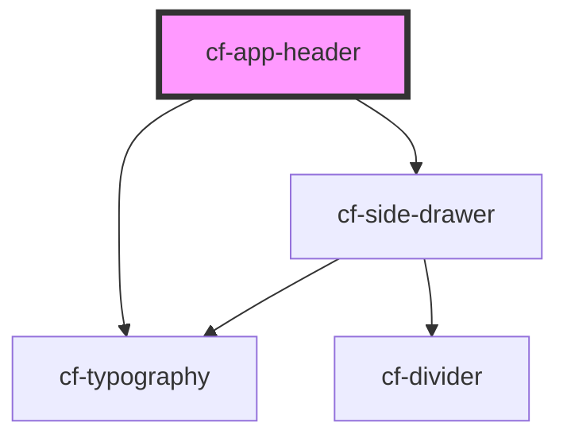

# cf-app-header

<!-- Auto Generated Below -->

## Properties

| Property      | Attribute      | Description | Type         | Default     |
| ------------- | -------------- | ----------- | ------------ | ----------- |
| `appName`     | `app-name`     |             | `string`     | `undefined` |
| `drawerOpen`  | `drawer-open`  |             | `boolean`    | `false`     |
| `drawerTitle` | `drawer-title` |             | `string`     | `undefined` |
| `navMenus`    | --             |             | `INavMenu[]` | `undefined` |

## Events

| Event              | Description | Type               |
| ------------------ | ----------- | ------------------ |
| `drawerOpenChange` |             | `CustomEvent<any>` |

## Dependencies

### Depends on

- [cf-typography](../cf-typography)
- [cf-side-drawer](../cf-side-drawer)

### Graph

----------------------------------------------

*Built with [StencilJS](https://stenciljs.com/)*
