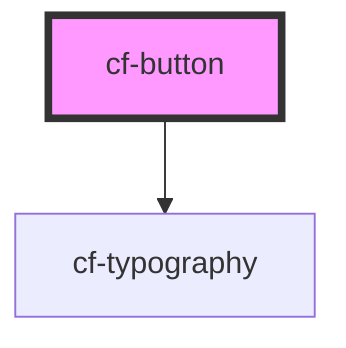

# cf-button

<!-- Auto Generated Below -->

## Properties

| Property   | Attribute  | Description | Type                                                                                | Default     |
| ---------- | ---------- | ----------- | ----------------------------------------------------------------------------------- | ----------- |
| `disabled` | `disabled` |             | `boolean`                                                                           | `undefined` |
| `text`     | `text`     |             | `string`                                                                            | `undefined` |
| `type`     | `type`     |             | `"default" \| "error" \| "info" \| "primary" \| "subtle" \| "success" \| "warning"` | `'primary'` |

## Dependencies

### Depends on

- [cf-typography](../cf-typography)

### Graph

----------------------------------------------

*Built with [StencilJS](https://stenciljs.com/)*
