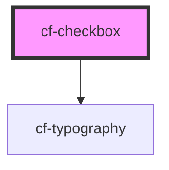

# cf-checkbox

<!-- Auto Generated Below -->

## Properties

| Property  | Attribute | Description | Type      | Default |
| --------- | --------- | ----------- | --------- | ------- |
| `checked` | `checked` |             | `boolean` | `false` |

## Events

| Event          | Description | Type                                 |
| -------------- | ----------- | ------------------------------------ |
| `checkboxInit` |             | `CustomEvent<HTMLCfCheckboxElement>` |
| `checkChange`  |             | `CustomEvent<HTMLCfCheckboxElement>` |

## Dependencies

### Depends on

- [cf-typography](../cf-typography)

### Graph

----------------------------------------------

*Built with [StencilJS](https://stenciljs.com/)*
