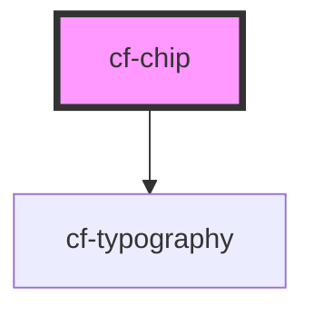

# cf-chip

<!-- Auto Generated Below -->

## Properties

| Property    | Attribute   | Description | Type                                                                                               | Default     |
| ----------- | ----------- | ----------- | -------------------------------------------------------------------------------------------------- | ----------- |
| `addable`   | `addable`   |             | `boolean`                                                                                          | `false`     |
| `removable` | `removable` |             | `boolean`                                                                                          | `false`     |
| `type`      | `type`      |             | `"default" \| "error" \| "info" \| "primary" \| "secondary" \| "subtle" \| "success" \| "warning"` | `'primary'` |

## Events

| Event         | Description | Type               |
| ------------- | ----------- | ------------------ |
| `click`       |             | `CustomEvent<any>` |
| `clickAdd`    |             | `CustomEvent<any>` |
| `clickRemove` |             | `CustomEvent<any>` |

## Dependencies

### Depends on

- [cf-typography](../cf-typography)

### Graph

----------------------------------------------

*Built with [StencilJS](https://stenciljs.com/)*
