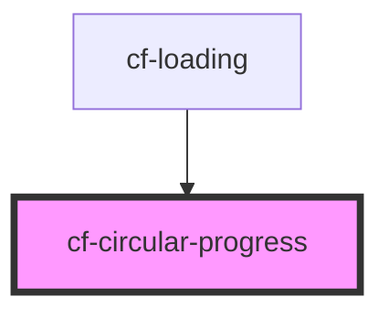

# cf-circular-progress

<!-- Auto Generated Below -->

## Properties

| Property   | Attribute  | Description | Type                               | Default           |
| ---------- | ---------- | ----------- | ---------------------------------- | ----------------- |
| `color`    | `color`    |             | `"primary" \| "secondary"`         | `undefined`       |
| `progress` | `progress` |             | `number`                           | `0`               |
| `type`     | `type`     |             | `"determinate" \| "indeterminate"` | `'indeterminate'` |

## Dependencies

### Used by

 - [cf-loading](../cf-loading)

### Graph

----------------------------------------------

*Built with [StencilJS](https://stenciljs.com/)*
