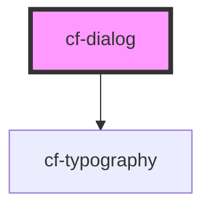

# cf-dialog

<!-- Auto Generated Below -->

## Properties

| Property      | Attribute      | Description | Type                  | Default                                                                 |
| ------------- | -------------- | ----------- | --------------------- | ----------------------------------------------------------------------- |
| `content`     | --             |             | `HTMLElement`         | `undefined`                                                             |
| `dialogStyle` | --             |             | `CSSStyleDeclaration` | `{     height: '400px',     width: '600px',   } as CSSStyleDeclaration` |
| `dialogTitle` | `dialog-title` |             | `string`              | `undefined`                                                             |
| `footer`      | --             |             | `HTMLElement`         | `undefined`                                                             |
| `strictClose` | `strict-close` |             | `boolean`             | `false`                                                                 |

## Events

| Event   | Description | Type               |
| ------- | ----------- | ------------------ |
| `close` |             | `CustomEvent<any>` |

## Dependencies

### Depends on

- [cf-typography](../cf-typography)

### Graph

----------------------------------------------

*Built with [StencilJS](https://stenciljs.com/)*
