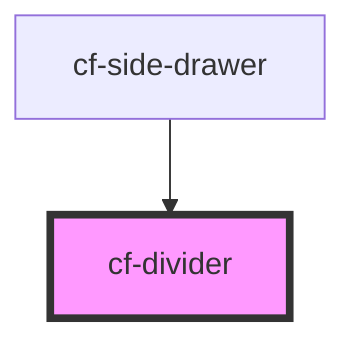

# cf-divider

<!-- Auto Generated Below -->

## Properties

| Property       | Attribute       | Description | Type                                              | Default |
| -------------- | --------------- | ----------- | ------------------------------------------------- | ------- |
| `gutterBottom` | `gutter-bottom` |             | `"g0" \| "g12" \| "g16" \| "g20" \| "g4" \| "g8"` | `'g0'`  |

## Dependencies

### Used by

 - [cf-side-drawer](../cf-side-drawer)

### Graph

----------------------------------------------

*Built with [StencilJS](https://stenciljs.com/)*
