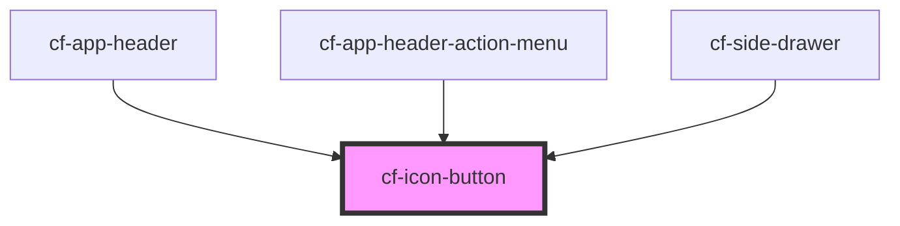

# cf-icon-button

<!-- Auto Generated Below -->

## Properties

| Property | Attribute | Description | Type                                                                                               | Default     |
| -------- | --------- | ----------- | -------------------------------------------------------------------------------------------------- | ----------- |
| `icon`   | `icon`    |             | `string`                                                                                           | `undefined` |
| `type`   | `type`    |             | `"default" \| "error" \| "info" \| "primary" \| "secondary" \| "subtle" \| "success" \| "warning"` | `'primary'` |

## Dependencies

### Used by

 - [cf-app-header](../cf-app-header)
 - [cf-app-header-action-menu](../cf-app-header/cf-app-header-action-menu)
 - [cf-side-drawer](../cf-side-drawer)

### Graph

----------------------------------------------

*Built with [StencilJS](https://stenciljs.com/)*
