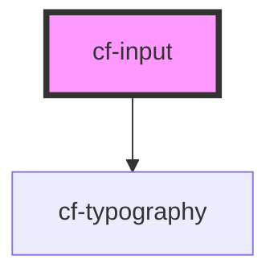

# cf-input

<!-- Auto Generated Below -->

## Properties

| Property      | Attribute     | Description | Type                               | Default     |
| ------------- | ------------- | ----------- | ---------------------------------- | ----------- |
| `label`       | `label`       |             | `string`                           | `undefined` |
| `placeholder` | `placeholder` |             | `string`                           | `undefined` |
| `status`      | `status`      |             | `"error" \| "normal" \| "warning"` | `'normal'`  |
| `type`        | `type`        |             | `"number" \| "string"`             | `'string'`  |
| `value`       | `value`       |             | `any`                              | `undefined` |

## Events

| Event         | Description | Type                  |
| ------------- | ----------- | --------------------- |
| `valueChange` |             | `CustomEvent<string>` |

## Dependencies

### Depends on

- [cf-typography](../cf-typography)

### Graph

----------------------------------------------

*Built with [StencilJS](https://stenciljs.com/)*
