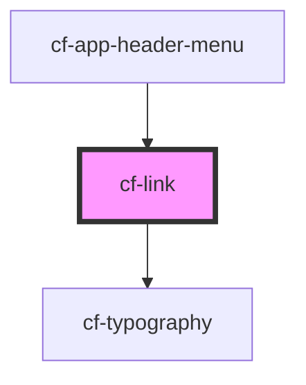

# cf-link

<!-- Auto Generated Below -->

## Properties

| Property         | Attribute         | Description | Type                                                                                                                               | Default       |
| ---------------- | ----------------- | ----------- | ---------------------------------------------------------------------------------------------------------------------------------- | ------------- |
| `href`           | `href`            |             | `string`                                                                                                                           | `''`          |
| `newTab`         | `new-tab`         |             | `boolean`                                                                                                                          | `true`        |
| `styles`         | --                |             | `{ [key: string]: string; }`                                                                                                       | `undefined`   |
| `typographyType` | `typography-type` |             | `"body1" \| "body2" \| "button" \| "caption" \| "h1" \| "h2" \| "h3" \| "h4" \| "h5" \| "h6" \| "p" \| "subtitle1" \| "subtitle2"` | `'subtitle1'` |
| `underline`      | `underline`       |             | `boolean`                                                                                                                          | `true`        |

## Dependencies

### Used by

 - [cf-app-header-menu](../cf-app-header/cf-app-header-menu)

### Depends on

- [cf-typography](../cf-typography)

### Graph

----------------------------------------------

*Built with [StencilJS](https://stenciljs.com/)*
