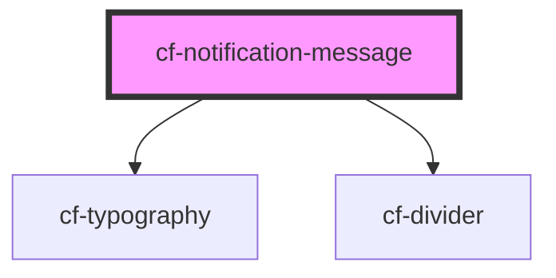

# cf-notification-message

<!-- Auto Generated Below -->

## Properties

| Property       | Attribute       | Description | Type                                          | Default          |
| -------------- | --------------- | ----------- | --------------------------------------------- | ---------------- |
| `messageTitle` | `message-title` |             | `string`                                      | `'Notification'` |
| `type`         | `type`          |             | `"error" \| "info" \| "success" \| "warning"` | `undefined`      |

## Dependencies

### Depends on

- [cf-typography](../../cf-typography)
- [cf-divider](../../cf-divider)

### Graph

----------------------------------------------

*Built with [StencilJS](https://stenciljs.com/)*
