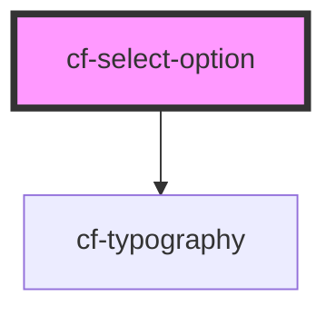

# cf-select-option

<!-- Auto Generated Below -->

## Properties

| Property   | Attribute  | Description | Type      | Default     |
| ---------- | ---------- | ----------- | --------- | ----------- |
| `name`     | `name`     |             | `string`  | `undefined` |
| `selected` | `selected` |             | `boolean` | `false`     |
| `value`    | `value`    |             | `any`     | `undefined` |

## Events

| Event               | Description | Type               |
| ------------------- | ----------- | ------------------ |
| `selectOptionClick` |             | `CustomEvent<any>` |

## Dependencies

### Depends on

- [cf-typography](../../cf-typography)

### Graph

----------------------------------------------

*Built with [StencilJS](https://stenciljs.com/)*
