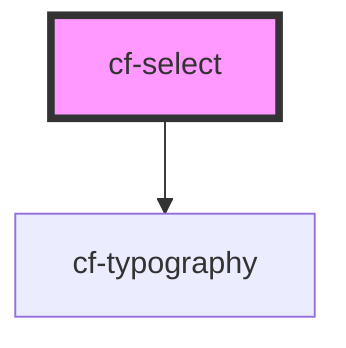

# cf-select

<!-- Auto Generated Below -->

## Properties

| Property       | Attribute       | Description | Type              | Default     |
| -------------- | --------------- | ----------- | ----------------- | ----------- |
| `isVirtualize` | `is-virtualize` |             | `boolean`         | `false`     |
| `options`      | --              |             | `ISelectOption[]` | `[]`        |
| `selected`     | --              |             | `ISelectOption`   | `undefined` |

## Events

| Event            | Description | Type                         |
| ---------------- | ----------- | ---------------------------- |
| `selectedChange` |             | `CustomEvent<ISelectOption>` |

## Dependencies

### Depends on

- [cf-typography](../cf-typography)

### Graph

----------------------------------------------

*Built with [StencilJS](https://stenciljs.com/)*
