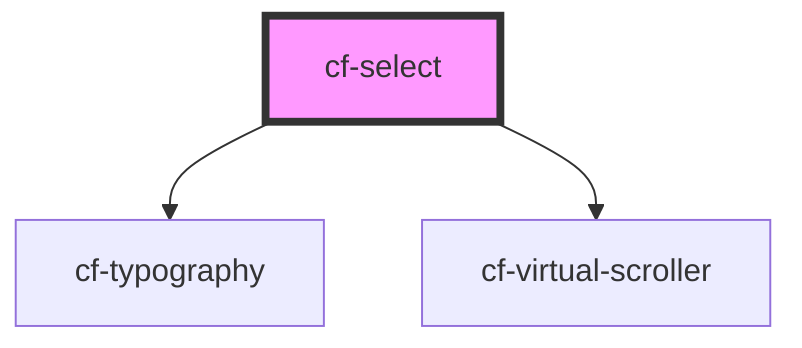

# cf-select

<!-- Auto Generated Below -->

## Properties

| Property      | Attribute     | Description | Type     | Default |
| ------------- | ------------- | ----------- | -------- | ------- |
| `placeholder` | `placeholder` |             | `string` | `''`    |

## Events

| Event            | Description | Type                                     |
| ---------------- | ----------- | ---------------------------------------- |
| `selectedChange` |             | `CustomEvent<HTMLCfSelectOptionElement>` |

## Dependencies

### Depends on

- [cf-typography](../cf-typography)
- [cf-virtual-scroller](../cf-virtual-scroller)

### Graph

----------------------------------------------

*Built with [StencilJS](https://stenciljs.com/)*
