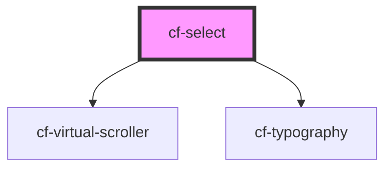

# cf-select

<!-- Auto Generated Below -->

## Properties

| Property         | Attribute     | Description | Type                          | Default     |
| ---------------- | ------------- | ----------- | ----------------------------- | ----------- |
| `placeholder`    | `placeholder` |             | `string`                      | `''`        |
| `virtualOptions` | --            |             | `HTMLCfSelectOptionElement[]` | `undefined` |

## Events

| Event            | Description | Type                                     |
| ---------------- | ----------- | ---------------------------------------- |
| `selectedChange` |             | `CustomEvent<HTMLCfSelectOptionElement>` |

## Dependencies

### Depends on

- [cf-virtual-scroller](../cf-virtual-scroller)
- [cf-typography](../cf-typography)

### Graph

----------------------------------------------

*Built with [StencilJS](https://stenciljs.com/)*
