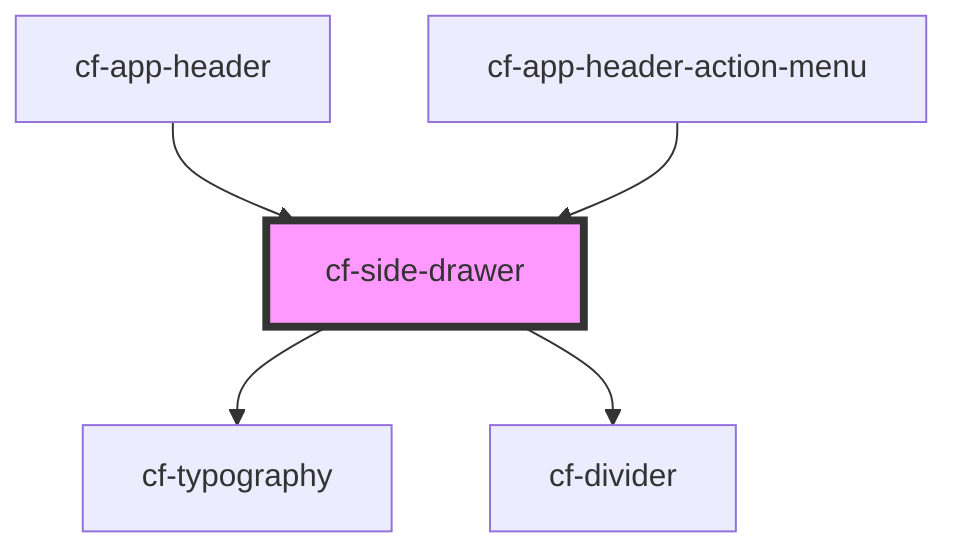

# cf-side-drawer

<!-- Auto Generated Below -->

## Properties

| Property      | Attribute      | Description | Type                | Default  |
| ------------- | -------------- | ----------- | ------------------- | -------- |
| `drawerTitle` | `drawer-title` |             | `string`            | `'Menu'` |
| `position`    | `position`     |             | `"left" \| "right"` | `'left'` |
| `visible`     | `visible`      |             | `boolean`           | `false`  |

## Events

| Event   | Description | Type                      |
| ------- | ----------- | ------------------------- |
| `close` |             | `CustomEvent<MouseEvent>` |

## Dependencies

### Used by

 - [cf-app-header](../cf-app-header)
 - [cf-app-header-action-menu](../cf-app-header/cf-app-header-action-menu)

### Depends on

- [cf-typography](../cf-typography)
- [cf-divider](../cf-divider)

### Graph

----------------------------------------------

*Built with [StencilJS](https://stenciljs.com/)*
