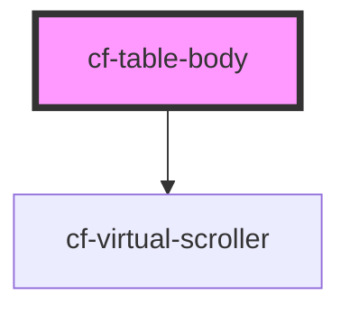

# cf-table-body

<!-- Auto Generated Below -->

## Properties

| Property     | Attribute     | Description | Type      | Default |
| ------------ | ------------- | ----------- | --------- | ------- |
| `bodyHeight` | `body-height` |             | `number`  | `100`   |
| `rowHeight`  | `row-height`  |             | `number`  | `36`    |
| `virtualize` | `virtualize`  |             | `boolean` | `false` |

## Dependencies

### Depends on

- [cf-virtual-scroller](../../cf-virtual-scroller)

### Graph

----------------------------------------------

*Built with [StencilJS](https://stenciljs.com/)*
