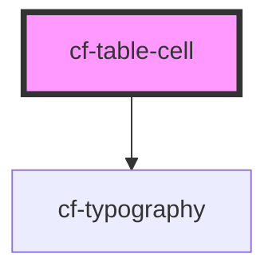

# cf-table-cell

<!-- Auto Generated Below -->

## Properties

| Property   | Attribute  | Description | Type                            | Default  |
| ---------- | ---------- | ----------- | ------------------------------- | -------- |
| `position` | `position` |             | `"center" \| "left" \| "right"` | `'left'` |
| `size`     | `size`     |             | `number`                        | `1`      |
| `type`     | `type`     |             | `"body" \| "foot" \| "head"`    | `'body'` |

## Events

| Event         | Description | Type                                  |
| ------------- | ----------- | ------------------------------------- |
| `tblCellInit` |             | `CustomEvent<HTMLCfTableCellElement>` |

## Dependencies

### Depends on

- [cf-typography](../../cf-typography)

### Graph

----------------------------------------------

*Built with [StencilJS](https://stenciljs.com/)*
