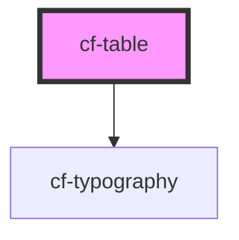

# cf-table

<!-- Auto Generated Below -->

## Properties

| Property               | Attribute    | Description | Type                     | Default |
| ---------------------- | ------------ | ----------- | ------------------------ | ------- |
| `columns`              | --           |             | `ITblColumn[]`           | `[]`    |
| `data`                 | --           |             | `IVirtualItem[]`         | `[]`    |
| `footers`              | --           |             | `ITblFooterColumn[]`     | `[]`    |
| `virtualizationOption` | --           |             | `IVirtualScrollSettings` | `{}`    |
| `virtualize`           | `virtualize` |             | `boolean`                | `false` |

## Events

| Event      | Description | Type               |
| ---------- | ----------- | ------------------ |
| `rowClick` |             | `CustomEvent<any>` |

## Dependencies

### Depends on

- [cf-typography](../cf-typography)

### Graph

----------------------------------------------

*Built with [StencilJS](https://stenciljs.com/)*
