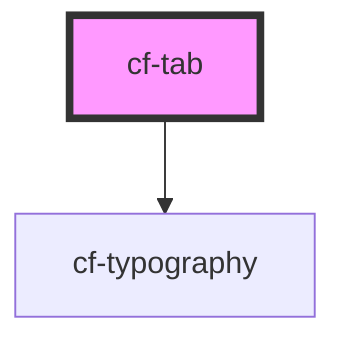

# cf-tab

<!-- Auto Generated Below -->

## Properties

| Property | Attribute | Description | Type                                                                                   | Default     |
| -------- | --------- | ----------- | -------------------------------------------------------------------------------------- | ----------- |
| `active` | `active`  |             | `boolean`                                                                              | `false`     |
| `color`  | `color`   |             | `"default" \| "error" \| "info" \| "primary" \| "secondary" \| "success" \| "warning"` | `'primary'` |
| `tabId`  | `tab-id`  |             | `any`                                                                                  | `undefined` |

## Events

| Event      | Description | Type               |
| ---------- | ----------- | ------------------ |
| `clickTab` |             | `CustomEvent<any>` |

## Dependencies

### Depends on

- [cf-typography](../../cf-typography)

### Graph

----------------------------------------------

*Built with [StencilJS](https://stenciljs.com/)*
