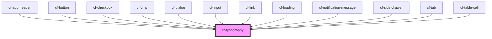

# cf-typography

<!-- Auto Generated Below -->

## Properties

| Property       | Attribute       | Description | Type                                                                                                                               | Default |
| -------------- | --------------- | ----------- | ---------------------------------------------------------------------------------------------------------------------------------- | ------- |
| `ellipsis`     | `ellipsis`      |             | `boolean`                                                                                                                          | `false` |
| `gutterBottom` | `gutter-bottom` |             | `"g0" \| "g12" \| "g16" \| "g20" \| "g24" \| "g28" \| "g32" \| "g4" \| "g8"`                                                       | `'g0'`  |
| `type`         | `type`          |             | `"body1" \| "body2" \| "button" \| "caption" \| "h1" \| "h2" \| "h3" \| "h4" \| "h5" \| "h6" \| "p" \| "subtitle1" \| "subtitle2"` | `'p'`   |

## Dependencies

### Used by

 - [cf-app-header](../cf-app-header)
 - [cf-button](../cf-button)
 - [cf-checkbox](../cf-checkbox)
 - [cf-chip](../cf-chip)
 - [cf-dialog](../cf-dialog)
 - [cf-input](../cf-input)
 - [cf-link](../cf-link)
 - [cf-loading](../cf-loading)
 - [cf-notification-message](../cf-notification/cf-notification-message)
 - [cf-side-drawer](../cf-side-drawer)
 - [cf-tab](../cf-tabs/cf-tab)
 - [cf-table-cell](../cf-table/cf-table-cell)

### Graph

----------------------------------------------

*Built with [StencilJS](https://stenciljs.com/)*
