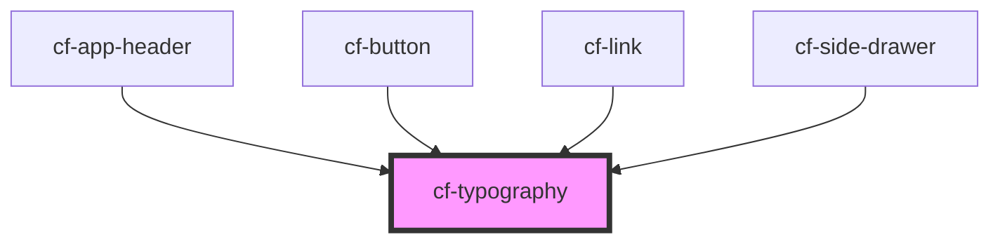

# cf-typography

<!-- Auto Generated Below -->

## Properties

| Property | Attribute | Description | Type                                                                                                                               | Default |
| -------- | --------- | ----------- | ---------------------------------------------------------------------------------------------------------------------------------- | ------- |
| `type`   | `type`    |             | `"body1" \| "body2" \| "button" \| "caption" \| "h1" \| "h2" \| "h3" \| "h4" \| "h5" \| "h6" \| "p" \| "subtitle1" \| "subtitle2"` | `'p'`   |

## Dependencies

### Used by

 - [cf-app-header](../cf-app-header)
 - [cf-button](../cf-button)
 - [cf-link](../cf-link)
 - [cf-side-drawer](../cf-side-drawer)

### Graph

----------------------------------------------

*Built with [StencilJS](https://stenciljs.com/)*
