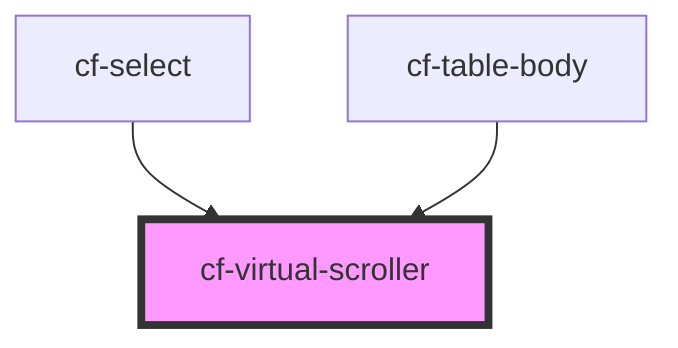

# cf-virtual-scroller

<!-- Auto Generated Below -->

## Properties

| Property                  | Attribute                    | Description | Type            | Default     |
| ------------------------- | ---------------------------- | ----------- | --------------- | ----------- |
| `childHeight`             | `child-height`               |             | `number`        | `20`        |
| `containerClassName`      | `container-class-name`       |             | `string`        | `undefined` |
| `containerHeight`         | `container-height`           |             | `number`        | `100`       |
| `innerContainerClassName` | `inner-container-class-name` |             | `string`        | `undefined` |
| `items`                   | --                           |             | `HTMLElement[]` | `[]`        |
| `windowLimit`             | `window-limit`               |             | `number`        | `5`         |

## Dependencies

### Used by

 - [cf-select](../cf-select)
 - [cf-table-body](../cf-table/cf-table-body)

### Graph

----------------------------------------------

*Built with [StencilJS](https://stenciljs.com/)*
