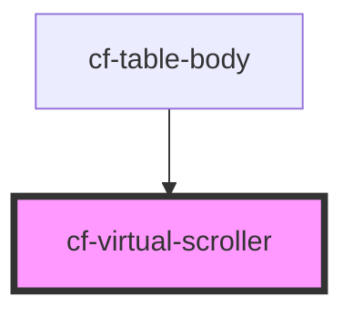

# cf-virtual-scroller

<!-- Auto Generated Below -->

## Properties

| Property                  | Attribute                    | Description | Type                                                                                                                                      | Default     |
| ------------------------- | ---------------------------- | ----------- | ----------------------------------------------------------------------------------------------------------------------------------------- | ----------- |
| `childHeight`             | `child-height`               |             | `number`                                                                                                                                  | `20`        |
| `containerClassName`      | `container-class-name`       |             | `string`                                                                                                                                  | `undefined` |
| `containerHeight`         | `container-height`           |             | `number`                                                                                                                                  | `100`       |
| `cssUnit`                 | `css-unit`                   |             | `"%" \| "Q" \| "ch" \| "cm" \| "em" \| "ex" \| "in" \| "lh" \| "mm" \| "pc" \| "pt" \| "px" \| "rem" \| "vh" \| "vmax" \| "vmin" \| "vw"` | `'px'`      |
| `innerContainerClassName` | `inner-container-class-name` |             | `string`                                                                                                                                  | `undefined` |
| `windowLimit`             | `window-limit`               |             | `number`                                                                                                                                  | `5`         |

## Dependencies

### Used by

 - [cf-table-body](../cf-table/cf-table-body)

### Graph

----------------------------------------------

*Built with [StencilJS](https://stenciljs.com/)*
